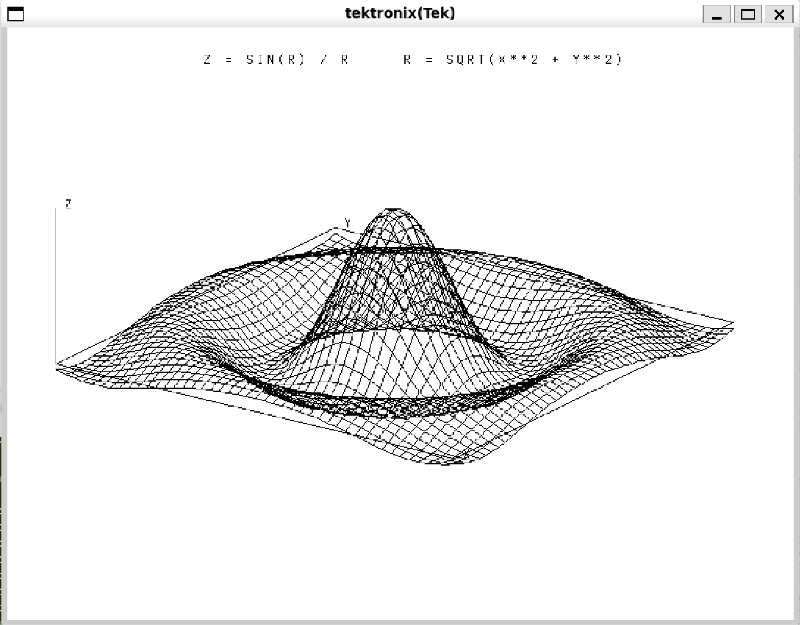
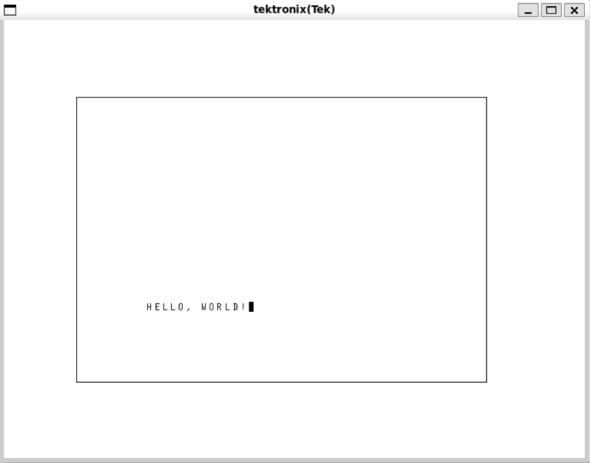
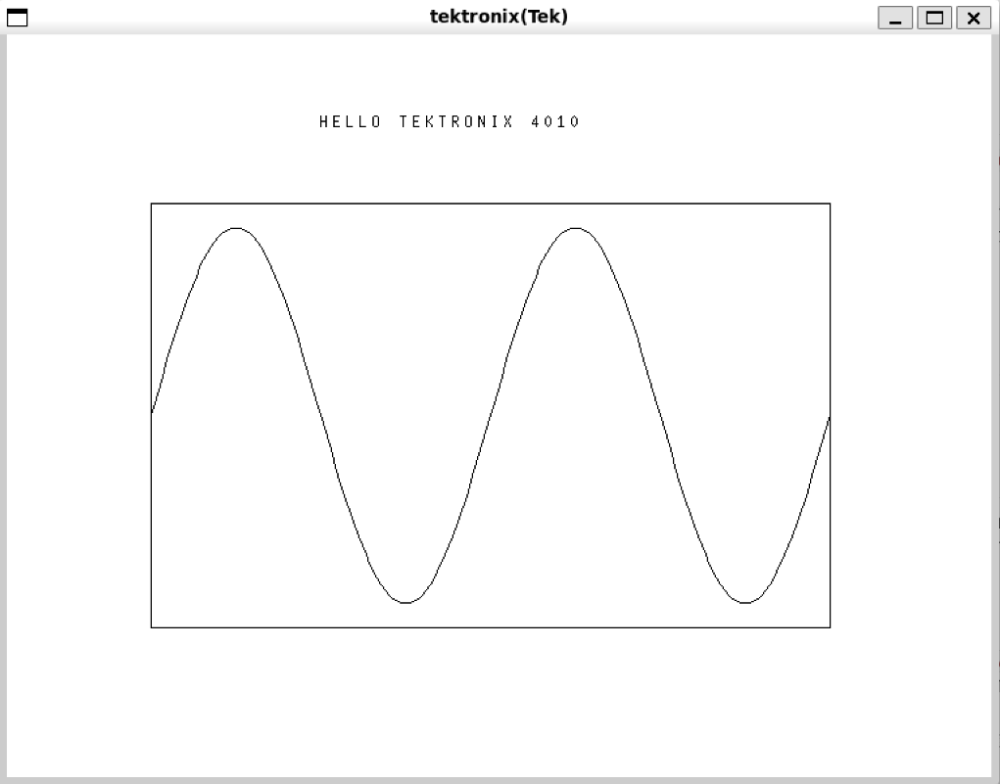

# Tektronix 4010 サンプル on WSL2 Ubuntu 24

**更新日付:** 2026-05-18
**作者:** tommie.jp

> **Note:** 本ドキュメントは [Claude Code](https://claude.com/claude-code)(Anthropic) と協力して執筆しました。コード例・歴史的背景・プロトコル解説などの初稿を Claude Code に書いてもらい、作者(tommie.jp)が検証・編集・加筆して仕上げています。

Ubuntu 24 で一番手軽なのは、**xterm の組み込み Tek 4014 エミュレータ** にそのまま喋らせる方法です。WSL2 なら WSLg で GUI が出るので追加設定不要。



↑ 本リポジトリの最終ゴール: **xterm の Tek 4014 エミュレータ上に sombrero 関数 (`z = sin(r)/r`) の 3D ワイヤーフレームを描く**(詳しくは [3D ワイヤーフレーム曲面プロット](#3d-ワイヤーフレーム曲面プロット) を参照)。

## 目次

- [Tektronix 4010 サンプル on WSL2 Ubuntu 24](#tektronix-4010-サンプル-on-wsl2-ubuntu-24)
  - [目次](#目次)
  - [Tektronix 4010 の歴史的価値](#tektronix-4010-の歴史的価値)
    - [なぜ革命的だったか](#なぜ革命的だったか)
    - [文化・技術への影響](#文化技術への影響)
    - [DVST という独特の使い心地](#dvst-という独特の使い心地)
    - [現代に学ぶ意味](#現代に学ぶ意味)
  - [セットアップ](#セットアップ)
  - [Tektronix 4010 コマンド概要](#tektronix-4010-コマンド概要)
    - [描画モード](#描画モード)
    - [主な制御文字](#主な制御文字)
    - [座標の 4 バイトエンコーディング](#座標の-4-バイトエンコーディング)
    - [高位バイト省略最適化](#高位バイト省略最適化)
    - [典型的なシーケンス例](#典型的なシーケンス例)
    - [4010 / 4014 / 4014-EGM の違い](#4010--4014--4014-egm-の違い)
  - [サンプルコード(プロトコルを直に叩く C)](#サンプルコードプロトコルを直に叩く-c)
  - [実行](#実行)
  - [何が見えるか(正弦波デモ)](#何が見えるか正弦波デモ)
  - [バイト列を覗いてみたい場合](#バイト列を覗いてみたい場合)
  - [ワンライナーで済ませたい(gnuplot 経由)](#ワンライナーで済ませたいgnuplot-経由)
  - [つまずきポイント](#つまずきポイント)
  - [3D ワイヤーフレーム曲面プロット](#3d-ワイヤーフレーム曲面プロット)
    - [`tek_surface.c`](#tek_surfacec)
    - [ビルドと実行](#ビルドと実行)
    - [何が見えるか(3D 曲面)](#何が見えるか3d-曲面)
    - [数式を変えて遊ぶ](#数式を変えて遊ぶ)
    - [さらに「らしく」したいなら(発展課題)](#さらにらしくしたいなら発展課題)

## Tektronix 4010 の歴史的価値

Tektronix 4010 は **1972 年に発売された、世界で初めて「普通のエンジニアが買える値段」になったグラフィックス端末**です。コンピュータグラフィックスの民主化を一気に押し進めた、歴史的に極めて重要な機械です。

### なぜ革命的だったか

1970 年代初頭、コンピュータでグラフィックスを描くには **フレームバッファ + リフレッシュ駆動の CRT** が必要で、その時点ではビデオ RAM が高すぎて 1024×780 解像度を保持するメモリだけで数万ドルしました。CAD ができるグラフィックス端末は IBM 2250 や Evans & Sutherland のような **$100,000 超の代物** で、研究所や大企業の一部門にやっと 1 台、という世界でした。

Tektronix はそこに **DVST (Direct-View Storage Tube、直視型蓄積管)** という別解を投入します。これは CRT の蛍光面に画像を「焼き付ける」電子管で、一度描けば**メモリなしで数十分は表示が保たれる**。リフレッシュ不要、つまり高価なビデオ RAM が不要。結果として 4010 は **発売時 $3,950** で、ミニコンに繋いで使える価格帯に降りてきました。

| 機種 | 年 | 価格(当時) | 解像度 | 特徴 |
| :--- | :---: | :---: | :---: | :--- |
| **IBM 2250** | 1965 | $100,000+ | 1024×1024 | リフレッシュ駆動 CRT |
| **Tektronix 4010** | 1972 | $3,950 | 1024×780 | DVST (蓄積管) 採用の革命児 |
| **Evans & Sutherland PS-300** | 1981 | $70,000+ | カラー | 高級ベクトルグラフィックス |
| **IBM PC + CGA** | 1981 | $1,565 | 320×200 | 4色、PC によるグラフィック普及 |

これによって大学・研究所・中小企業の机の上にグラフィックスがやってきました。**「PC 普及前の 10 年間、科学技術可視化の事実上の標準**」 と言える存在です。

### 文化・技術への影響

- **CAD の黎明期を支えた**: AutoCAD の前身、Computervision、SDRC など初期 CAD ソフトの開発はほぼ全て Tek 端末上で行われました。
- **gnuplot, MATLAB, IDL の出力先**: 初期版はみな Tek 4014 出力をサポート。今でも `set terminal tek40xx` は生きています。
- **ARPANET / 初期 UNIX 文化との結合**: BSD には `plot(1)` コマンドがあり、出力は Tek プロトコル。MIT、Stanford、PARC、Bell Labs で日常的に使われ、Brian Kernighan の `pic` や `grap` も Tek を経由して図を出していました。
- **ワイヤーフレーム CG 美学の原点**: 1970 年代後半の SF 映画(『未知との遭遇』、初代『スター・ウォーズ』のデス・スター作戦ブリーフィング、『TRON』)に出てくる「緑のワイヤーフレーム」のビジュアル言語は、Tek 4010 の実画面そのものです。
- **xterm に今も Tek モードが内蔵**: `xterm -t` で 50 年以上前のプロトコルが今のディスプレイに描けるのは、当時このプロトコルが事実上の標準だった証拠です。
- **エミュレーション文化**: HP やデジタル(DEC)の端末も「Tek 4014 互換モード」を持つのが普通でした。プロトコル仕様が公開されていたこともあり、**ASCII の次に互換実装が多いベンダープロトコル**と言われます。

### DVST という独特の使い心地

蓄積管なので、

- **描いた線は消せない**: 1 本の線を消すには画面全体を消去(緑のフラッシュ + 約 1 秒の消去パルス)するしかない。
- **アニメーション不可**: そのため初期のグラフィックスソフトは「最初に全部計算してから一気に描く」発想で書かれた。後の double-buffer の概念に直結します。
- **ペーパーレスを最初に実現**: それまでペンプロッタに出力していた図がリアルタイムに画面に出る — 紙とインクの節約が研究室レベルで起きた最初の事例でもあります。

### 現代に学ぶ意味

このリポジトリで叩いている **4 バイト 10-bit 座標プロトコル** は、9600 baud のシリアル回線で 1024×780 の図を送るために設計された、極めて密度の高いバイナリエンコーディングです。**Hi バイト省略の差分送信**、**move/draw の状態フラグ**、**alpha/graph モード切替**といった工夫は、現代の GPU コマンドストリームや WebGL の頂点バッファ設計にも通じる発想で、リソース制約下のプロトコル設計の手本になっています。

たった 4 バイトで点を 1 つ描く — その軽さを今のラップトップで体験できるのが、このサンプルの一番の楽しみどころです。

## セットアップ

```bash
sudo apt install xterm build-essential
```

## Tektronix 4010 コマンド概要

4010 のプロトコルは **ASCII の制御文字でモードを切り替え、座標は 4 バイトのバイナリで送る** という極めて簡潔な設計です。9600 baud で図を送るために徹底的に詰められており、覚えるべきことは多くありません。

### 描画モード

端末は受信したバイトを「今どのモードか」で解釈します。モードは制御文字 1 バイトで瞬時に切り替わります。

| モード | 進入する制御文字 | 用途 |
| --- | --- | --- |
| **Alpha (text) mode** | `US` (0x1F) | テキスト描画。最後の描画位置からカーソルが動き、文字ごとに 8 ドット右へ進む。電源投入時の初期モード |
| **Graph (vector) mode** | `GS` (0x1D) | 直線描画。`GS` 直後の最初の座標は **move**(描画なし)、続く座標は前の点からの **draw** |
| **Point Plot mode** | `FS` (0x1C) | 点プロット。各座標で 1 ドットだけ描く(線は引かない) |
| **Incremental Plot mode** | `RS` (0x1E) | 4014 で追加。1 文字 = 1 ドットの方向移動(8 方向 + pen up/down) |
| **Bypass mode** | `CAN` (0x18) | 端末側の解釈を止め、ホストへ素通し(ハードコピー応答などに使用) |

### 主な制御文字

| 文字 | 16 進 | 機能 |
| --- | --- | --- |
| `ESC` `FF` | 0x1B 0x0C | **画面消去**(緑のフラッシュ + 約 1 秒の消去パルス)。同時に Alpha mode へ戻る |
| `ESC` `ENQ` | 0x1B 0x05 | **ステータス問合せ**。端末が状態バイト + GIN 座標を返す |
| `ESC` `ETB` | 0x1B 0x17 | **ハードコピー**(4631 等の専用プリンタにダンプ) |
| `ESC` `SUB` | 0x1B 0x1A | **GIN モード** (Graphic Input)。クロスヘアでカーソル位置入力 |
| `BEL` | 0x07 | ベル |
| `BS` | 0x08 | カーソル 1 文字戻し(Alpha) |
| `HT` | 0x09 | タブ |
| `LF` | 0x0A | 改行(Alpha) |
| `VT` | 0x0B | 1 行上へ(Alpha) |
| `CR` | 0x0D | 行頭へ。**同時に Alpha mode へ復帰** |

> **覚えておくべき副作用:** `CR` や `US` はモードを Alpha に戻します。`GS`(Graph)の中で間違って改行を入れると、以降の座標バイトがテキストとして表示されてしまいます。

### 座標の 4 バイトエンコーディング

10-bit (0–1023) の x, y を、上位ビットでバイト種別が判別できる 4 バイトに分けて送ります。

```
バイト        | ビット      | 値域          | 内容
-------------|------------|---------------|---------------------------
Hi-Y         | 001 yyyyy  | 0x20–0x3F     | Y 座標の上位 5 ビット
Lo-Y         | 011 yyyyy  | 0x60–0x7F     | Y 座標の下位 5 ビット
Hi-X         | 001 xxxxx  | 0x20–0x3F     | X 座標の上位 5 ビット
Lo-X         | 010 xxxxx  | 0x40–0x5F     | X 座標の下位 5 ビット ← これで描画確定
```

順序は **必ず Hi-Y → Lo-Y → Hi-X → Lo-X**。最後の Lo-X を受信した瞬間に端末は move/draw を実行します。

座標系は **左下原点**、可視範囲 **0 ≤ x ≤ 1023, 0 ≤ y ≤ 779**(4014 では 4096×3120 に拡張、追加バイトで 12-bit 化)。

### 高位バイト省略最適化

前回の座標から**高位ビットが変化していなければ、Hi-Y / Hi-X を省略可能**。Lo-Y の有無も判定できます(端末は受信バイトを上位ビットで識別するため、欠けていても区別がつく)。実用上の効果:

| 状況 | 必要バイト数 |
| --- | --- |
| 完全な座標(初回や大ジャンプ後) | 4 バイト |
| Y の上位が同じ(よくある近接点) | 3 バイト |
| Y がほぼ同じ、X だけ動く(水平線スキャン) | 2 バイト |

正弦波や格子線のように **連続した近接点を多数送る場面では、平均 2–3 バイト/点** まで縮みます。9600 baud(約 1KB/s)で 1024×780 のフル画面を出すには、この差分送信が決定的に効きました。

### 典型的なシーケンス例

`HELLO, WORLD!` を矩形枠の中に描く最小例:

```
1B 0C                              ESC FF              画面消去
1D                                 GS                  Graph mode へ
24 60 24 40                        Hi-Y Lo-Y Hi-X Lo-X (128,128) を move
24 60 3B 40                                            (864,128) へ draw → 下辺
34 60 3B 40                                            (864,640) へ draw → 右辺
34 60 24 40                                            (128,640) へ draw → 上辺
24 60 24 40                                            (128,128) へ draw → 左辺
1D                                 GS                  カーソルリセット
28 60 28 40                                            位置 (256,256) へ move
1F                                 US                  Alpha mode へ戻る
48 45 4C 4C 4F 2C 20 57 4F 52 4C 44 21   "HELLO, WORLD!"   テキスト描画
```

> **メモ:** 13 文字目までの `,` (0x2C) や半角空白 (0x20) は数値だけ見ると **Graph mode の Hi-Y/Hi-X 範囲 (0x20–0x3F)** に被りますが、直前に `US` (0x1F) を送って **Alpha mode** へ入っているので、端末は単純な印字文字として扱います。モードの状態管理が利いている良い例です。

実機の応答時間や DVST の消去パルスを考えると、画面消去後すぐに `GS` を送るのではなく **800ms 程度 sleep を挟む**のが定石でした(`tek_demo.c` の `usleep(800000)` がそれ)。

#### bash で直接実行

C コードを書かなくても、`printf` で上記バイト列を作って xterm の Tek モードに流し込めば動きます。

> **ヒント:** `printf` は **bash の組み込みコマンドかつ coreutils の `/usr/bin/printf`** として、Ubuntu を含む全ての Linux で標準で使えます。
>
> ```bash
> type printf            # → printf is a shell builtin
> which printf           # → /usr/bin/printf
> dpkg -S /usr/bin/printf  # → coreutils: /usr/bin/printf
> ```
>
> もし万一見当たらない極小コンテナ等で使う場合は `sudo apt install coreutils` でインストールできます。**バイナリ出力を期待する用途では `echo -e` ではなく必ず `printf` を使ってください** — `echo` の `-e` 解釈はシェル/環境依存で `\x` エスケープが効かないことがあります。

```bash
# (1) バイト列をファイルに書く
printf '\x1b\x0c\x1d\x24\x60\x24\x40\x24\x60\x3b\x40\x34\x60\x3b\x40\x34\x60\x24\x40\x24\x60\x24\x40\x1d\x28\x60\x28\x40\x1fHELLO, WORLD!' > /tmp/hello.tek

# (2) xterm を Tek モードで起動して再生
xterm -t -hold -e cat /tmp/hello.tek
```

ワンライナーにしたいなら:

```bash
xterm -t -hold -e bash -c $'printf \'\\x1b\\x0c\\x1d\\x24\\x60\\x24\\x40\\x24\\x60\\x3b\\x40\\x34\\x60\\x3b\\x40\\x34\\x60\\x24\\x40\\x24\\x60\\x24\\x40\\x1d\\x28\\x60\\x28\\x40\\x1fHELLO, WORLD!\'; sleep 3'
```

`/tmp/hello.tek` の中身を `xxd` で見ると、上の表とバイト単位で一致するのが確認できます。

> **ヒント:** `xxd` が入っていない場合は `vim-common` パッケージに含まれています。Ubuntu 24 なら下記でインストール可能:
>
> ```bash
> sudo apt install xxd          # Ubuntu 24 以降は単独パッケージあり
> # 古い Ubuntu/Debian の場合:
> sudo apt install vim-common
> ```
>
> 代替として `hexdump -C /tmp/hello.tek`(`bsdmainutils` パッケージ、通常はプリインストール)や `od -A x -t x1z /tmp/hello.tek` でも同じことができます。

```bash
xxd /tmp/hello.tek
# 00000000: 1b0c 1d24 6024 4024 603b 4034 603b 4034  ...$`$@$`;@4`;@4
# 00000010: 6024 4024 6024 401d 2860 2840 1f48 454c  `$@$`$@.(`(@.HEL
# 00000020: 4c4f 2c20 574f 524c 4421                 LO, WORLD!
```

実行結果のスクリーンショット:



(WSL2 では `explorer.exe ss01-hello.png` または `mspaint.exe ss01-hello.png` で Windows のフォト/ペイントが開きます)

### 4010 / 4014 / 4014-EGM の違い

- **4010** (1972): 基本 10-bit 座標、1024×780、モノクロ蓄積管。
- **4014** (1974): 12-bit 座標(4096×3120)に拡張。追加の **Extra-Y バイト** が前置される。サイズも大型化(19 インチ)。
- **4014 + Enhanced Graphics Module (EGM)**: 線種(破線・点線等)、文字サイズ 4 種、Incremental plot mode などを追加。

xterm の Tek モードは **4014 + EGM 互換**なので、上記の追加機能も使えます。ただし 4010 の純粋なバイト列だけでもほとんどのデモは動くので、互換性重視なら 10-bit に留めておくのが無難です。

## サンプルコード(プロトコルを直に叩く C)

`tek_demo.c`:

```c
/* tek_demo.c — Tektronix 4010 の最小サンプル
 *   ・画面消去 → 矩形 → 正弦波 → ラベル を描く
 * build: cc -O2 -o tek_demo tek_demo.c -lm
 * run  : xterm -t -hold -e ./tek_demo
 */
#include <stdio.h>
#include <math.h>
#include <unistd.h>

#define ESC "\x1b"
#define GS  "\x1d"   /* Graph mode へ */
#define US  "\x1f"   /* Alpha mode へ戻る */
#define FF  "\x0c"   /* Form Feed(ESC FF で画面消去)*/

/* 10-bit (x,y) を Tek の 4 バイトで送る。Lo-X で描画確定。 */
static void tek_xy(int x, int y) {
    putchar(0x20 | ((y >> 5) & 0x1f));   /* Hi-Y  001 YYYYY */
    putchar(0x60 | ( y       & 0x1f));   /* Lo-Y  011 YYYYY */
    putchar(0x20 | ((x >> 5) & 0x1f));   /* Hi-X  001 XXXXX */
    putchar(0x40 | ( x       & 0x1f));   /* Lo-X  010 XXXXX */
}

int main(void) {
    /* (1) 画面消去。xterm では ESC FF が同時に Tek ウィンドウへ
           スイッチするトリガにもなる。 */
    fputs(ESC FF, stdout);
    fflush(stdout);
    usleep(800000);                      /* ストレージチューブの消去待ち */

    /* (2) 矩形:GS の直後の最初の座標は move(描画なし)。
           以降の座標が直前点からの直線を描く。 */
    fputs(GS, stdout);
    tek_xy(150, 150);                    /* move */
    tek_xy(870, 150);                    /* draw → 下辺 */
    tek_xy(870, 600);                    /* draw → 右辺 */
    tek_xy(150, 600);                    /* draw → 上辺 */
    tek_xy(150, 150);                    /* draw → 左辺(閉じる) */

    /* (3) 矩形内に正弦波。新しい GS でカーソルをリセットして
           最初の点を move、続きを draw。 */
    fputs(GS, stdout);
    for (int x = 150; x <= 870; x += 4) {
        double t = (x - 150) / 720.0 * 4.0 * M_PI;
        int y = 375 + (int)(200.0 * sin(t));
        tek_xy(x, y);
    }

    /* (4) ラベル:GS で位置決め(最初の座標は move のみ)→ US で
           Alpha mode に戻ると、そこからテキストが書ける。 */
    fputs(GS, stdout);
    tek_xy(330, 680);
    fputs(US, stdout);
    fputs("HELLO TEKTRONIX 4010", stdout);

    fflush(stdout);
    return 0;
}
```

## 実行

```bash
cc -O2 -o tek_demo tek_demo.c -lm
xterm -t -hold -e ./tek_demo
```

- `-t` … xterm を最初から Tek 4014 モードで起動
- `-hold` … プロセスが終わってもウィンドウを残す(描画を見続けるため)

ウィンドウ内で **Ctrl + 中クリック** すると "Switch to VT Mode" や "Reset" などのメニューが出ます。

## 何が見えるか(正弦波デモ)

下辺〜上辺の矩形枠の中で 2 周期分の正弦波が描かれ、上に `HELLO TEKTRONIX 4010` の大文字テキストが表示されます。座標系は左下原点で 1024×780 が可視範囲。

実行結果のスクリーンショット:



> **Tip (WSL2 Ubuntu 24):** WSL2 上から Windows の画像ビューアを直接呼び出せます。
>
> ```bash
> explorer.exe ss02-sine.png   # 関連付け済みアプリ(通常は「フォト」)で開く
> mspaint.exe   ss02-sine.png  # 「ペイント」で開く — ピクセル等倍ズーム・簡単な編集に便利
> ```
>
> WSL のパスは自動で Windows パスに変換されます(`\\wsl$\Ubuntu24.04\...` 経由)。`mspaint.exe` は同期(プロセスが開いている間ブロック)、`explorer.exe` は非同期で起動します。

## バイト列を覗いてみたい場合

```bash
./tek_demo | xxd | head
```

最初の数バイトはこんな感じになるはずです:

```
1b 0c                ← ESC FF (erase)
1d                   ← GS    (enter graph mode)
24 76 24 56          ← Hi-Y Lo-Y Hi-X Lo-X for (150, 150)
                       Y=150 → 0x24 0x76,  X=150 → 0x24 0x56
24 76 3b 46          ← (870, 150)
...
```

`Y=150` の場合:

- `150 >> 5 = 4` → Hi-Y = `0x20 | 4 = 0x24`
- `150 & 0x1f = 22` → Lo-Y = `0x60 | 22 = 0x76`

`X=150` も同じ計算で、Hi-X = `0x20 | 4 = 0x24`、Lo-X = `0x40 | 22 = 0x56`。`X=870` のときは `870 >> 5 = 27` → Hi-X = `0x3b`、`870 & 0x1f = 6` → Lo-X = `0x46`。

このように **`xxd` の出力と手計算が完全に一致する**のが Tek プロトコルのデバッグの楽しいところで、ASCII の制御文字と printable 範囲だけで全部読めてしまいます(各バイトが上位 3 ビットで Hi-Y/Lo-Y/Hi-X/Lo-X のどれかを自己識別できるよう設計されているため)。

## ワンライナーで済ませたい(gnuplot 経由)

プロトコルを書きたくないなら:

```bash
sudo apt install gnuplot
xterm -t -e gnuplot -e 'set terminal tek40xx; plot sin(x); pause -1'
```

これだけで gnuplot が Tek 4014 バイト列を生成して xterm が描画します。`set terminal xterm` でも同様(中身は Tek エミュレーション経由)。

## つまずきポイント

- **WSL2 だが xterm の窓が出ない** → `echo $DISPLAY` を確認。WSLg なら `:0` が入っているはず。空なら Ubuntu を `wsl --update` で最新版に。
- **Tek ウィンドウが小さい** → xterm のリソース指定で `xterm -t -geometry 1024x780 -hold -e ./tek_demo`。
- **テキストが思った位置に出ない** → 4010 の文字セルは 8×9 ドット(垂直方向は実は ~22 ドット間隔。テキストは最後に描いた点を 8×8 文字セルの左下隅として書かれ、各文字で 8 ドット右に進む)。座標は左下原点なので、テキストを置きたいベースライン位置を `tek_xy` で指定する。
- **`Warning: Cannot convert string "9x15" to type FontStruct`(等)が出る** → WSLg の X server は Tek 用ビットマップフォント (`9x15` / `8x13` / `6x10`) を持っておらず(`xlsfonts` で見ても 6 個しか無い)、xterm の Tek モード初期化時にフォント解決失敗の警告を吐きます。実害はなく描画は出ますが、煩いので **`fixed` フォントへ差し替え**ます:

  ```bash
  TEKFONTS=(
    -xrm 'XTerm*tek4014*fontLarge: fixed'
    -xrm 'XTerm*tek4014*font2: fixed'
    -xrm 'XTerm*tek4014*font3: fixed'
    -xrm 'XTerm*tek4014*fontSmall: fixed'
  )
  xterm -t -hold "${TEKFONTS[@]}" -e ./tek_demo
  ```

  `fixed` は **どの X server にも必ずある**保証フォント。このリポジトリの `doBuild-0[1-3]-*.sh` には既にこの対策を入れてあります。フォント自体を入れたい場合は `sudo apt install xfonts-base` で `/usr/share/fonts/X11/misc/` に置かれますが、WSLg の X server に **font path を動的に追加できない**(`xset +fp` が `bad font path element` で失敗)ため、結局 `-xrm` での差し替えが現実解です。

慣れてきたら、`tek_xy` の高位バイト省略最適化(前回と Hi-X / Hi-Y が同じなら省略)を入れると、生成バイト数が半分くらいになって「ああこれが当時のシリアル回線で意味あったやつか」と体感できます。

## 3D ワイヤーフレーム曲面プロット

3D ワイヤーフレームの曲面プロットをやりましょう。1970 年代の Tek デモの定番中の定番で、見た目もかなり様になります。題材は **sombrero 関数** `z = sin(r)/r` です。

### `tek_surface.c`

```c
/* tek_surface.c — Tektronix 4010 で 3D ワイヤーフレーム曲面を描く
 *   sombrero function:  z = sin(r) / r,  r = sqrt(x²+y²)
 *
 * build: cc -O2 -o tek_surface tek_surface.c -lm
 * run  : xterm -t -hold -geometry 1024x780 -e ./tek_surface
 */
#include <stdio.h>
#include <math.h>
#include <unistd.h>

#define ESC "\x1b"
#define GS  "\x1d"
#define US  "\x1f"
#define FF  "\x0c"

#ifndef M_PI
#define M_PI 3.14159265358979323846
#endif

/* Tek 4010 座標送信(10-bit、4バイト)*/
static void tek_xy(int x, int y) {
    if (x < 0) x = 0; if (x > 1023) x = 1023;
    if (y < 0) y = 0; if (y > 779)  y = 779;
    putchar(0x20 | ((y >> 5) & 0x1f));
    putchar(0x60 | ( y       & 0x1f));
    putchar(0x20 | ((x >> 5) & 0x1f));
    putchar(0x40 | ( x       & 0x1f));
}

/* sombrero 関数 */
static double f(double x, double y) {
    double r = sqrt(x*x + y*y);
    return (r < 1e-6) ? 1.0 : sin(r) / r;
}

/* (wx,wy,wz) world → (sx,sy) Tek screen に正射影
 *   world: x=右、y=奥、z=上
 *   azimuth = Z軸まわり回転(視点の方位)
 *   elev    = X軸まわり回転(見下ろし角度)
 */
static void project(double wx, double wy, double wz, int *sx, int *sy) {
    const double azimuth = 35.0 * M_PI / 180.0;
    const double elev    = 20.0 * M_PI / 180.0;
    const double scale   = 38.0;
    const double cx = 512, cy = 360;

    /* azimuth: Z軸まわり */
    double ca = cos(azimuth), sa = sin(azimuth);
    double x1 =  ca * wx + sa * wy;
    double y1 = -sa * wx + ca * wy;

    /* elevation: X軸まわりで傾けて画面上方向に投影 */
    double ce = cos(elev), se = sin(elev);
    double sxw = x1;
    double syw = wz * ce + y1 * se;

    *sx = (int)(cx + sxw * scale);
    *sy = (int)(cy + syw * scale);
}

int main(void) {
    const int N = 45;                 /* メッシュ解像度 */
    const double range  = 8.5;        /* x,y in [-range, range] */
    const double zscale = 5.0;        /* 高さ強調倍率 */

    /* (1) 画面消去 */
    fputs(ESC FF, stdout);
    fflush(stdout);
    usleep(800000);

    /* (2) タイトル */
    int sx, sy;
    fputs(GS, stdout);
    tek_xy(260, 730);
    fputs(US, stdout);
    fputs("Z = SIN(R) / R     R = SQRT(X**2 + Y**2)", stdout);

    /* (3) ベース矩形(z=0 平面のバウンディング)*/
    fputs(GS, stdout);
    project(-range, -range, 0, &sx, &sy); tek_xy(sx, sy);
    project( range, -range, 0, &sx, &sy); tek_xy(sx, sy);
    project( range,  range, 0, &sx, &sy); tek_xy(sx, sy);
    project(-range,  range, 0, &sx, &sy); tek_xy(sx, sy);
    project(-range, -range, 0, &sx, &sy); tek_xy(sx, sy);

    /* (4) X 方向の格子線(y固定で x を走らせる)*/
    for (int j = 0; j < N; j++) {
        double y = -range + 2.0 * range * j / (N - 1);
        fputs(GS, stdout);
        for (int i = 0; i < N; i++) {
            double x = -range + 2.0 * range * i / (N - 1);
            project(x, y, zscale * f(x, y), &sx, &sy);
            tek_xy(sx, sy);
        }
    }

    /* (5) Y 方向の格子線(x固定で y を走らせる)*/
    for (int i = 0; i < N; i++) {
        double x = -range + 2.0 * range * i / (N - 1);
        fputs(GS, stdout);
        for (int j = 0; j < N; j++) {
            double y = -range + 2.0 * range * j / (N - 1);
            project(x, y, zscale * f(x, y), &sx, &sy);
            tek_xy(sx, sy);
        }
    }

    /* (6) 軸 + ラベル */
    fputs(GS, stdout);
    project(-range, -range, 0,             &sx, &sy); tek_xy(sx, sy);
    project(-range, -range, zscale * 1.15, &sx, &sy); tek_xy(sx, sy);
    fputs(US, stdout); fputs(" Z", stdout);

    fputs(GS, stdout);
    project( range, -range, 0, &sx, &sy); tek_xy(sx, sy);
    fputs(US, stdout); fputs(" X", stdout);

    fputs(GS, stdout);
    project(-range,  range, 0, &sx, &sy); tek_xy(sx, sy);
    fputs(US, stdout); fputs(" Y", stdout);

    fflush(stdout);
    return 0;
}
```

### ビルドと実行

```bash
cc -O2 -o tek_surface tek_surface.c -lm
xterm -t -hold -geometry 1024x780 -e ./tek_surface
```

### 何が見えるか(3D 曲面)

中央に sombrero(同心円状の波紋が外側に減衰していく形)が浮き上がり、その下に底面のひし形(z=0 平面の枠)、3 本の軸ラベル(X, Y, Z)、上部にタイトルが配置されます。メッシュは 45×45 でちょうど良い密度。

実行結果のスクリーンショット:


(WSL2 では `explorer.exe ss03-surface.png` または `mspaint.exe ss03-surface.png` で Windows のフォト/ペイントが開きます)

バイト数は約 4000 点 × 4 バイト + α で **17 KB** ほど。9600 baud の実機なら約 15 秒かけて少しずつ描かれていくのが見られたはずですが、xterm では一瞬で出ます。

### 数式を変えて遊ぶ

`f()` を差し替えるだけで違う風景になります。

```c
/* 鞍点 saddle */
static double f(double x, double y) { return 0.05 * (x*x - y*y); }

/* 卵パック egg crate */
static double f(double x, double y) { return sin(x) * cos(y); }

/* ガウス峰 */
static double f(double x, double y) { return 2.0 * exp(-(x*x + y*y) / 8.0); }

/* Matlab "peaks" 風 */
static double f(double x, double y) {
    double a = 3*(1-x)*(1-x) * exp(-x*x - (y+1)*(y+1));
    double b = -10*(x/5 - x*x*x - y*y*y*y*y) * exp(-x*x - y*y);
    double c = -exp(-(x+1)*(x+1) - y*y) / 3.0;
    return 0.3 * (a + b + c);
}
```

視点を変えるなら `project()` の中の `azimuth` と `elev` を弄ってください。`azimuth` を時間で増やしてループにすれば「回転アニメ」になりますが、Tek 4010 はストレージチューブなので各フレームで `ESC FF`(全消去)が必要で、約 1 秒のフラッシュが入ります。xterm エミュではそれが省かれるので連続再描画も可能。

### さらに「らしく」したいなら(発展課題)

このコードは**隠線処理なし**(see-through)です。1970 年代の Tek デモが格好良かった最大の理由は **floating horizon algorithm**(浮動水平線法)による隠線処理が入っていたからです。アルゴリズム:

1. 画面横方向に `horizon_top[1024]` と `horizon_bot[1024]` を持つ(初期値 `INT_MIN` と `INT_MAX`)
2. 格子線を**手前から奥**に向かう順に描く
3. 各線分を 1 ピクセル列ずつ走査し、`sy > horizon_top[sx]` または `sy < horizon_bot[sx]` の部分だけを描画
4. 描画したら horizon を更新

これを足すと、奥の山が手前の山に隠れる本物の 3D 表現になります。soft-FPGA 教材としても良い題材で、ハード化するなら scanline ごとの max/min 比較器を並べるだけで実装できます。

もう一段上の遊びとして、出力を `> demo.tek` でファイルに落とし、`rricharz/Tek4010` エミュレータで再生すると、当時の描画速度と残光フェードまで再現された姿が見られます。スクリーンキャプチャすると Tek 4010 の本物の写真と並べても区別がつかないレベル。
