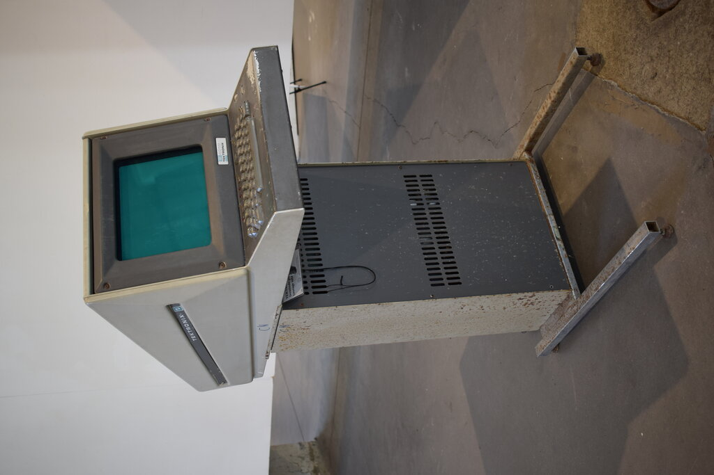

# Tektronix 4010 Samples on WSL2 Ubuntu 24

[English](README.md) | [日本語](README.ja.md)

**Last updated:** 2026-05-18
**Author:** tommie.jp

> **Note:** This document was written in collaboration with [Claude Code](https://claude.com/claude-code) (Anthropic). Claude Code drafted the code examples, historical background, and protocol explanations, which the author (tommie.jp) verified, edited, and expanded.

On Ubuntu 24, the easiest path is to speak directly to **xterm's built-in Tek 4014 emulator**. On WSL2, WSLg renders the GUI out of the box — no extra setup needed.


↑ The ultimate goal of this repository: **draw a 3D wireframe of the sombrero function (`z = sin(r)/r`) on xterm's Tek 4014 emulator** (see [3D Wireframe Surface Plot](#3d-wireframe-surface-plot) for details).

## Table of Contents

- [Tektronix 4010 Samples on WSL2 Ubuntu 24](#tektronix-4010-samples-on-wsl2-ubuntu-24)
  - [Table of Contents](#table-of-contents)
  - [Historical Significance of the Tektronix 4010](#historical-significance-of-the-tektronix-4010)
    - [Why it was revolutionary](#why-it-was-revolutionary)
    - [Cultural & technical impact](#cultural--technical-impact)
    - [The peculiar feel of DVST](#the-peculiar-feel-of-dvst)
    - [What we can learn today](#what-we-can-learn-today)
  - [Setup](#setup)
  - [Tektronix 4010 Command Reference](#tektronix-4010-command-reference)
    - [Drawing modes](#drawing-modes)
    - [Key control characters](#key-control-characters)
    - [The 4-byte coordinate encoding](#the-4-byte-coordinate-encoding)
    - [High-byte omission optimization](#high-byte-omission-optimization)
    - [A typical byte sequence](#a-typical-byte-sequence)
    - [4010 / 4014 / 4014-EGM differences](#4010--4014--4014-egm-differences)
  - [Sample Code (driving the protocol directly in C)](#sample-code-driving-the-protocol-directly-in-c)
  - [Running it](#running-it)
  - [What you should see (sine demo)](#what-you-should-see-sine-demo)
  - [Peeking at the byte stream](#peeking-at-the-byte-stream)
  - [Shortcut: do it with gnuplot](#shortcut-do-it-with-gnuplot)
  - [Pitfalls](#pitfalls)
  - [3D Wireframe Surface Plot](#3d-wireframe-surface-plot)
    - [`tek_surface.c`](#tek_surfacec)
    - [Build and run](#build-and-run)
    - [What you should see (3D surface)](#what-you-should-see-3d-surface)
    - [Play with different functions](#play-with-different-functions)
    - [Going further (advanced exercise)](#going-further-advanced-exercise)
  - [References](#references)

## Historical Significance of the Tektronix 4010



*Photo: Piergiovanna Grossi, [CC BY-SA 4.0](https://creativecommons.org/licenses/by-sa/4.0), via [Wikimedia Commons](https://commons.wikimedia.org/wiki/File:Tektronix_4010_DSC_0056.jpg) (resized to 1024px wide).*

The Tektronix 4010, released in **1972**, was **the first graphics terminal that an ordinary engineer could actually afford**. It was the machine that single-handedly pushed the democratization of computer graphics forward, and it is historically very important.

### Why it was revolutionary

In the early 1970s, drawing computer graphics required a **frame buffer plus a refresh-driven CRT**, and at that time video RAM was so expensive that the memory alone for a 1024×780 image cost tens of thousands of dollars. CAD-capable graphics terminals like the IBM 2250 or the Evans & Sutherland systems were **over $100,000 machines** — labs and big corporate divisions might have one, total.

Tektronix attacked the problem from a different angle: the **DVST (Direct-View Storage Tube)**. This is a special CRT that "burns" an image onto its phosphor — once drawn, the image **persists for tens of minutes without any memory backing it**. No refresh needed, so no expensive video RAM needed. The 4010 launched at **$3,950**, dragging graphics into the price range of a minicomputer add-on.

| Model | Year | Price (at launch) | Resolution | Notes |
| :--- | :---: | :---: | :---: | :--- |
| **IBM 2250** | 1965 | $100,000+ | 1024×1024 | Refresh-driven CRT |
| **Tektronix 4010** | 1972 | $3,950 | 1024×780 | DVST (storage tube) — the revolutionary one |
| **Evans & Sutherland PS-300** | 1981 | $70,000+ | color | High-end vector graphics |
| **IBM PC + CGA** | 1981 | $1,565 | 320×200 | 4 colors, brought graphics to PCs |

This put graphics on the desks of universities, research labs, and small-to-medium companies. For roughly **a decade before the PC era, the 4010 was the de facto standard for scientific and technical visualization**.

### Cultural & technical impact

- **It carried CAD through its early years.** The forerunners of AutoCAD, Computervision, SDRC and other early CAD packages were almost entirely developed on Tek terminals.
- **gnuplot, MATLAB, and IDL all output to it.** Every early version supported Tek 4014 output, and `set terminal tek40xx` still works today.
- **It fused with the ARPANET / early UNIX culture.** BSD shipped a `plot(1)` command whose output was Tek protocol. MIT, Stanford, PARC, and Bell Labs used it daily; Brian Kernighan's `pic` and `grap` routed figures through Tek.
- **It's the origin of the wireframe CG aesthetic.** The "green wireframe" visual language you see in late-1970s sci-fi (*Close Encounters*, the Death Star briefing in *Star Wars*, *TRON*) is literally a Tek 4010 screen.
- **xterm still has a Tek mode built in.** That you can run `xterm -t` today and drive a 50-year-old protocol from a modern display is proof of how dominant it was.
- **An emulation culture grew around it.** HP and DEC terminals routinely shipped a "Tek 4014 compatible mode." Because the protocol spec was public, it became **arguably the most-cloned vendor protocol after ASCII itself**.

### The peculiar feel of DVST

Because it was a storage tube:

- **You couldn't erase a single line.** To remove one stroke, you had to wipe the whole screen (a green flash followed by ~1 second of erase pulse).
- **Animation was impossible.** Early graphics software was therefore written in a "compute everything first, then draw it all at once" style — a direct ancestor of double-buffering.
- **It was the first practical paperless workflow.** Where engineers used to send drawings to pen plotters, they could now watch them appear on the screen in real time. The savings in paper and ink at the lab level were unprecedented.

### What we can learn today

The **4-byte 10-bit coordinate protocol** this repository drives was engineered to send a 1024×780 image over a 9600 baud serial line — it is an extremely dense binary encoding. **Differential transmission with high-byte omission**, **move/draw state flags**, and **alpha/graph mode switching** are all ideas that show up again in modern GPU command streams and WebGL vertex buffer design. It's a textbook example of protocol design under tight resource constraints.

Drawing a single point in just 4 bytes — feeling that lightness on a modern laptop is, frankly, the best part of these samples.

## Setup

```bash
sudo apt install xterm build-essential
```

## Tektronix 4010 Command Reference

The 4010 protocol has a refreshingly simple design: **ASCII control characters switch modes, and coordinates are sent as 4 binary bytes**. It was squeezed to fit 9600 baud — there really isn't much to memorize.

### Drawing modes

The terminal interprets each incoming byte based on its current mode. Modes switch on a single control character.

| Mode | Entered with | Purpose |
| --- | --- | --- |
| **Alpha (text) mode** | `US` (0x1F) | Draws text. The cursor advances from the last draw position, 8 dots per character. This is the power-on default. |
| **Graph (vector) mode** | `GS` (0x1D) | Line drawing. The first coordinate after `GS` is a **move** (no draw); subsequent coordinates are **draws** from the previous point. |
| **Point Plot mode** | `FS` (0x1C) | Point plot. Each coordinate sets exactly one dot (no lines). |
| **Incremental Plot mode** | `RS` (0x1E) | Added on the 4014. One character = one dot, with directional movement (8 directions + pen up/down). |
| **Bypass mode** | `CAN` (0x18) | Stops terminal-side interpretation and passes bytes through to the host (used for hardcopy responses, etc.). |

### Key control characters

| Char | Hex | Function |
| --- | --- | --- |
| `ESC` `FF` | 0x1B 0x0C | **Erase screen** (green flash + ~1 second erase pulse). Also returns to Alpha mode. |
| `ESC` `ENQ` | 0x1B 0x05 | **Status enquiry.** The terminal returns a status byte + GIN coordinates. |
| `ESC` `ETB` | 0x1B 0x17 | **Hardcopy** (dump to a dedicated 4631-class printer). |
| `ESC` `SUB` | 0x1B 0x1A | **GIN mode** (Graphic Input). Crosshair cursor for picking a position. |
| `BEL` | 0x07 | Bell. |
| `BS` | 0x08 | Backspace one character (Alpha). |
| `HT` | 0x09 | Tab. |
| `LF` | 0x0A | Line feed (Alpha). |
| `VT` | 0x0B | Move up one line (Alpha). |
| `CR` | 0x0D | Carriage return. **Also returns to Alpha mode.** |

> **Side effect worth remembering:** `CR` and `US` both kick the terminal back into Alpha mode. If a stray newline sneaks into the middle of a `GS` (Graph) sequence, the following coordinate bytes will be rendered as text.

### The 4-byte coordinate encoding

The 10-bit (0–1023) x and y are split across 4 bytes whose upper bits identify which kind of byte they are.

```
Byte         | Bits        | Range         | Content
-------------|-------------|---------------|---------------------------
Hi-Y         | 001 yyyyy   | 0x20–0x3F     | Upper 5 bits of Y
Lo-Y         | 011 yyyyy   | 0x60–0x7F     | Lower 5 bits of Y
Hi-X         | 001 xxxxx   | 0x20–0x3F     | Upper 5 bits of X
Lo-X         | 010 xxxxx   | 0x40–0x5F     | Lower 5 bits of X ← triggers draw
```

The order is **always Hi-Y → Lo-Y → Hi-X → Lo-X**. The terminal executes the move/draw at the moment it receives the final Lo-X.

The coordinate system has its **origin at the bottom-left**, with visible range **0 ≤ x ≤ 1023, 0 ≤ y ≤ 779**. The 4014 extends this to 4096×3120 (12 bits) by prepending extra bytes.

### High-byte omission optimization

If the high bits haven't changed since the previous coordinate, **you may omit Hi-Y / Hi-X**. Lo-Y can also be omitted (the terminal identifies each byte by its upper bits, so it can tell what's missing). In practice:

| Situation | Bytes needed |
| --- | --- |
| Full coordinate (first one or after a big jump) | 4 bytes |
| Y high unchanged (typical of nearby points) | 3 bytes |
| Y almost identical, X moving (horizontal scan) | 2 bytes |

For long runs of nearby points like a sine wave or a mesh line, **the average drops to 2–3 bytes per point**. At 9600 baud (~1 KB/s), this differential transmission is what made a full 1024×780 screen feasible.

### A typical byte sequence

A minimal example that draws `HELLO, WORLD!` inside a rectangle:

```
1B 0C                              ESC FF              erase screen
1D                                 GS                  enter Graph mode
24 60 24 40                        Hi-Y Lo-Y Hi-X Lo-X move to (128,128)
24 60 3B 40                                            draw to (864,128) → bottom edge
34 60 3B 40                                            draw to (864,640) → right edge
34 60 24 40                                            draw to (128,640) → top edge
24 60 24 40                                            draw to (128,128) → left edge
1D                                 GS                  reset cursor
28 60 28 40                                            move to (256,256)
1F                                 US                  back to Alpha mode
48 45 4C 4C 4F 2C 20 57 4F 52 4C 44 21   "HELLO, WORLD!"   draw text
```

> **Note:** `,` (0x2C) and the space character (0x20) in the last line numerically overlap with the **Hi-Y/Hi-X range (0x20–0x3F) of Graph mode**. But since `US` (0x1F) was sent just before, the terminal is in **Alpha mode** and treats them as plain printable characters. A good example of how the mode state machine pays off.

In practice, you don't fire `GS` immediately after erasing — you wait. Real hardware needs time for the DVST erase pulse, so **inserting ~800 ms of sleep** after the erase was idiomatic (that's what `usleep(800000)` does in `tek_demo.c`).

#### Running it straight from bash

You don't even need C code — `printf` can produce the byte sequence above, and you pipe it into xterm's Tek mode.

> **Hint:** `printf` is **both a bash builtin and the coreutils `/usr/bin/printf`**, so every Linux system (including Ubuntu) has it.
>
> ```bash
> type printf            # → printf is a shell builtin
> which printf           # → /usr/bin/printf
> dpkg -S /usr/bin/printf  # → coreutils: /usr/bin/printf
> ```
>
> In the unlikely case it's missing in a tiny container, `sudo apt install coreutils` brings it back. **For binary output, always use `printf`, never `echo -e`** — the `-e` interpretation in `echo` is shell/environment-dependent and may silently drop `\x` escapes.

```bash
# (1) write the byte sequence to a file
printf '\x1b\x0c\x1d\x24\x60\x24\x40\x24\x60\x3b\x40\x34\x60\x3b\x40\x34\x60\x24\x40\x24\x60\x24\x40\x1d\x28\x60\x28\x40\x1fHELLO, WORLD!' > /tmp/hello.tek

# (2) launch xterm in Tek mode and play it back
xterm -t -hold -e cat /tmp/hello.tek
```

Or as a one-liner:

```bash
xterm -t -hold -e bash -c $'printf \'\\x1b\\x0c\\x1d\\x24\\x60\\x24\\x40\\x24\\x60\\x3b\\x40\\x34\\x60\\x3b\\x40\\x34\\x60\\x24\\x40\\x24\\x60\\x24\\x40\\x1d\\x28\\x60\\x28\\x40\\x1fHELLO, WORLD!\'; sleep 3'
```

You can verify byte-for-byte that `/tmp/hello.tek` matches the table above with `xxd`.

> **Hint:** If `xxd` isn't installed, it ships in the `vim-common` package. On Ubuntu 24 you can install it directly:
>
> ```bash
> sudo apt install xxd          # Ubuntu 24+ ships it as a standalone package
> # On older Ubuntu/Debian:
> sudo apt install vim-common
> ```
>
> As alternatives, `hexdump -C /tmp/hello.tek` (from `bsdmainutils`, usually preinstalled) or `od -A x -t x1z /tmp/hello.tek` do the same job.

```bash
xxd /tmp/hello.tek
# 00000000: 1b0c 1d24 6024 4024 603b 4034 603b 4034  ...$`$@$`;@4`;@4
# 00000010: 6024 4024 6024 401d 2860 2840 1f48 454c  `$@$`$@.(`(@.HEL
# 00000020: 4c4f 2c20 574f 524c 4421                 LO, WORLD!
```

Screenshot of the result:


(On WSL2, `explorer.exe ss01-hello.png` or `mspaint.exe ss01-hello.png` opens it in Windows' Photos / Paint.)

### 4010 / 4014 / 4014-EGM differences

- **4010** (1972): basic 10-bit coordinates, 1024×780, monochrome storage tube.
- **4014** (1974): extends coordinates to 12 bits (4096×3120) by prepending an **Extra-Y byte**. The physical screen also grew to 19 inches.
- **4014 + Enhanced Graphics Module (EGM)**: adds line styles (dashed, dotted, etc.), 4 character sizes, Incremental plot mode, and more.

xterm's Tek mode is **4014 + EGM compatible**, so all of these extensions work. But if you care about portability, sticking to plain 4010 byte sequences is the safe choice — almost every demo here works in 10-bit.

## Sample Code (driving the protocol directly in C)

`tek_demo.c`:

```c
/* tek_demo.c — minimal Tektronix 4010 sample
 *   erase screen → rectangle → sine wave → label
 * build: cc -O2 -o tek_demo tek_demo.c -lm
 * run  : xterm -t -hold -e ./tek_demo
 */
#include <stdio.h>
#include <math.h>
#include <unistd.h>

#define ESC "\x1b"
#define GS  "\x1d"   /* enter Graph mode */
#define US  "\x1f"   /* return to Alpha mode */
#define FF  "\x0c"   /* Form Feed (ESC FF erases the screen) */

/* Send a 10-bit (x,y) coordinate as 4 Tek bytes. Lo-X commits the draw. */
static void tek_xy(int x, int y) {
    putchar(0x20 | ((y >> 5) & 0x1f));   /* Hi-Y  001 YYYYY */
    putchar(0x60 | ( y       & 0x1f));   /* Lo-Y  011 YYYYY */
    putchar(0x20 | ((x >> 5) & 0x1f));   /* Hi-X  001 XXXXX */
    putchar(0x40 | ( x       & 0x1f));   /* Lo-X  010 XXXXX */
}

int main(void) {
    /* (1) Erase. In xterm, ESC FF is also the trigger that switches
           to the Tek window. */
    fputs(ESC FF, stdout);
    fflush(stdout);
    usleep(800000);                      /* wait for storage-tube erase */

    /* (2) Rectangle. After GS, the first coordinate is a move (no draw);
           subsequent coordinates draw lines from the previous point. */
    fputs(GS, stdout);
    tek_xy(150, 150);                    /* move */
    tek_xy(870, 150);                    /* draw → bottom edge */
    tek_xy(870, 600);                    /* draw → right edge */
    tek_xy(150, 600);                    /* draw → top edge */
    tek_xy(150, 150);                    /* draw → left edge (close) */

    /* (3) Sine wave inside the rectangle. A fresh GS resets the cursor,
           so the first point is a move and the rest are draws. */
    fputs(GS, stdout);
    for (int x = 150; x <= 870; x += 4) {
        double t = (x - 150) / 720.0 * 4.0 * M_PI;
        int y = 375 + (int)(200.0 * sin(t));
        tek_xy(x, y);
    }

    /* (4) Label: GS to position (the first coord is a move only),
           then US returns to Alpha mode and text can be written. */
    fputs(GS, stdout);
    tek_xy(330, 680);
    fputs(US, stdout);
    fputs("HELLO TEKTRONIX 4010", stdout);

    fflush(stdout);
    return 0;
}
```

## Running it

```bash
cc -O2 -o tek_demo tek_demo.c -lm
xterm -t -hold -e ./tek_demo
```

- `-t` … start xterm in Tek 4014 mode from the beginning.
- `-hold` … keep the window after the process exits (so you can keep looking at the picture).

**Ctrl + middle-click** inside the window brings up a menu with "Switch to VT Mode", "Reset", and friends.

## What you should see (sine demo)

A 2-period sine wave inside a bottom-to-top rectangular frame, with `HELLO TEKTRONIX 4010` in uppercase text above it. The coordinate system is bottom-left origin, with 1024×780 visible.

Screenshot of the result:


> **Tip (WSL2 Ubuntu 24):** You can call a Windows image viewer directly from WSL2.
>
> ```bash
> explorer.exe ss02-sine.png   # opens in the associated app (usually "Photos")
> mspaint.exe   ss02-sine.png  # opens in "Paint" — great for pixel-level zoom and quick edits
> ```
>
> WSL paths are translated to Windows paths automatically (via `\\wsl$\Ubuntu24.04\...`). `mspaint.exe` runs synchronously (blocks while open), while `explorer.exe` launches asynchronously.

## Peeking at the byte stream

```bash
./tek_demo | xxd | head
```

The first few bytes should look something like this:

```
1b 0c                ← ESC FF (erase)
1d                   ← GS    (enter graph mode)
24 76 24 56          ← Hi-Y Lo-Y Hi-X Lo-X for (150, 150)
                       Y=150 → 0x24 0x76,  X=150 → 0x24 0x56
24 76 3b 46          ← (870, 150)
...
```

For `Y=150`:

- `150 >> 5 = 4` → Hi-Y = `0x20 | 4 = 0x24`
- `150 & 0x1f = 22` → Lo-Y = `0x60 | 22 = 0x76`

`X=150` works the same way: Hi-X = `0x20 | 4 = 0x24`, Lo-X = `0x40 | 22 = 0x56`. For `X=870`, `870 >> 5 = 27` → Hi-X = `0x3b`, and `870 & 0x1f = 6` → Lo-X = `0x46`.

The fun part of debugging Tek is that **`xxd` output and a pencil-and-paper calculation match exactly** — you can read the whole thing using nothing but ASCII control characters and the printable range (the upper 3 bits of each byte self-identify as Hi-Y / Lo-Y / Hi-X / Lo-X by design).

## Shortcut: do it with gnuplot

If you'd rather skip writing the protocol yourself:

```bash
sudo apt install gnuplot
xterm -t -e gnuplot -e 'set terminal tek40xx; plot sin(x); pause -1'
```

That's it — gnuplot emits Tek 4014 bytes and xterm renders them. `set terminal xterm` works the same way (it routes through the Tek emulation internally).

## Pitfalls

- **xterm window doesn't appear on WSL2** → check `echo $DISPLAY`. WSLg should set it to `:0`. If it's empty, run `wsl --update` from Windows to get the latest Ubuntu.
- **The Tek window is too small** → use xterm's `-geometry`: `xterm -t -geometry 1024x780 -hold -e ./tek_demo`.
- **Text shows up in the wrong place** → the 4010 character cell is 8×9 dots (vertically the actual spacing is ~22 dots; text is drawn with the last plotted point at the lower-left corner of an 8×8 cell, and each character advances 8 dots right). Coordinates are bottom-left origin, so specify the desired baseline position via `tek_xy`.
- **`Warning: Cannot convert string "9x15" to type FontStruct` (etc.)** → WSLg's X server doesn't carry the legacy Tek bitmap fonts (`9x15` / `8x13` / `6x10`) — `xlsfonts` shows only 6 fonts — so xterm's Tek mode emits font-resolution warnings on startup. Drawing still works, but it's noisy. **Override with the `fixed` font instead:**

  ```bash
  TEKFONTS=(
    -xrm 'XTerm*tek4014*fontLarge: fixed'
    -xrm 'XTerm*tek4014*font2: fixed'
    -xrm 'XTerm*tek4014*font3: fixed'
    -xrm 'XTerm*tek4014*fontSmall: fixed'
  )
  xterm -t -hold "${TEKFONTS[@]}" -e ./tek_demo
  ```

  `fixed` is the **one font every X server is guaranteed to ship**. The `doBuild-0[1-3]-*.sh` scripts in this repo already apply this workaround. If you want the actual fonts, `sudo apt install xfonts-base` places them in `/usr/share/fonts/X11/misc/`, but WSLg's X server **refuses to add to its font path at runtime** (`xset +fp` fails with `bad font path element`), so the `-xrm` override is the realistic fix.

Once you're comfortable, try adding the high-byte omission trick to `tek_xy` (skip Hi-X/Hi-Y when they match the previous coordinate). The byte count drops by roughly half, and you start to feel viscerally why this mattered on a serial line.

## 3D Wireframe Surface Plot

Let's do a 3D wireframe surface plot — the quintessential 1970s Tek demo, and one that still looks impressive. The subject: the **sombrero function** `z = sin(r)/r`.

### `tek_surface.c`

```c
/* tek_surface.c — draw a 3D wireframe surface on a Tektronix 4010
 *   sombrero function:  z = sin(r) / r,  r = sqrt(x²+y²)
 *
 * build: cc -O2 -o tek_surface tek_surface.c -lm
 * run  : xterm -t -hold -geometry 1024x780 -e ./tek_surface
 */
#include <stdio.h>
#include <math.h>
#include <unistd.h>

#define ESC "\x1b"
#define GS  "\x1d"
#define US  "\x1f"
#define FF  "\x0c"

#ifndef M_PI
#define M_PI 3.14159265358979323846
#endif

/* Send a Tek 4010 coordinate (10-bit, 4 bytes). */
static void tek_xy(int x, int y) {
    if (x < 0) x = 0; if (x > 1023) x = 1023;
    if (y < 0) y = 0; if (y > 779)  y = 779;
    putchar(0x20 | ((y >> 5) & 0x1f));
    putchar(0x60 | ( y       & 0x1f));
    putchar(0x20 | ((x >> 5) & 0x1f));
    putchar(0x40 | ( x       & 0x1f));
}

/* sombrero function */
static double f(double x, double y) {
    double r = sqrt(x*x + y*y);
    return (r < 1e-6) ? 1.0 : sin(r) / r;
}

/* Orthographic projection: world (wx,wy,wz) → Tek screen (sx,sy)
 *   world: x=right, y=into the screen, z=up
 *   azimuth = rotation around Z axis (viewing direction)
 *   elev    = rotation around X axis (tilt)
 */
static void project(double wx, double wy, double wz, int *sx, int *sy) {
    const double azimuth = 35.0 * M_PI / 180.0;
    const double elev    = 20.0 * M_PI / 180.0;
    const double scale   = 38.0;
    const double cx = 512, cy = 360;

    /* azimuth: rotate around Z */
    double ca = cos(azimuth), sa = sin(azimuth);
    double x1 =  ca * wx + sa * wy;
    double y1 = -sa * wx + ca * wy;

    /* elevation: tilt around X and project onto the screen */
    double ce = cos(elev), se = sin(elev);
    double sxw = x1;
    double syw = wz * ce + y1 * se;

    *sx = (int)(cx + sxw * scale);
    *sy = (int)(cy + syw * scale);
}

int main(void) {
    const int N = 45;                 /* mesh resolution */
    const double range  = 8.5;        /* x,y in [-range, range] */
    const double zscale = 5.0;        /* vertical exaggeration */

    /* (1) erase */
    fputs(ESC FF, stdout);
    fflush(stdout);
    usleep(800000);

    /* (2) title */
    int sx, sy;
    fputs(GS, stdout);
    tek_xy(260, 730);
    fputs(US, stdout);
    fputs("Z = SIN(R) / R     R = SQRT(X**2 + Y**2)", stdout);

    /* (3) base rectangle (bounding box of the z=0 plane) */
    fputs(GS, stdout);
    project(-range, -range, 0, &sx, &sy); tek_xy(sx, sy);
    project( range, -range, 0, &sx, &sy); tek_xy(sx, sy);
    project( range,  range, 0, &sx, &sy); tek_xy(sx, sy);
    project(-range,  range, 0, &sx, &sy); tek_xy(sx, sy);
    project(-range, -range, 0, &sx, &sy); tek_xy(sx, sy);

    /* (4) mesh lines along X (y fixed, sweep x) */
    for (int j = 0; j < N; j++) {
        double y = -range + 2.0 * range * j / (N - 1);
        fputs(GS, stdout);
        for (int i = 0; i < N; i++) {
            double x = -range + 2.0 * range * i / (N - 1);
            project(x, y, zscale * f(x, y), &sx, &sy);
            tek_xy(sx, sy);
        }
    }

    /* (5) mesh lines along Y (x fixed, sweep y) */
    for (int i = 0; i < N; i++) {
        double x = -range + 2.0 * range * i / (N - 1);
        fputs(GS, stdout);
        for (int j = 0; j < N; j++) {
            double y = -range + 2.0 * range * j / (N - 1);
            project(x, y, zscale * f(x, y), &sx, &sy);
            tek_xy(sx, sy);
        }
    }

    /* (6) axes + labels */
    fputs(GS, stdout);
    project(-range, -range, 0,             &sx, &sy); tek_xy(sx, sy);
    project(-range, -range, zscale * 1.15, &sx, &sy); tek_xy(sx, sy);
    fputs(US, stdout); fputs(" Z", stdout);

    fputs(GS, stdout);
    project( range, -range, 0, &sx, &sy); tek_xy(sx, sy);
    fputs(US, stdout); fputs(" X", stdout);

    fputs(GS, stdout);
    project(-range,  range, 0, &sx, &sy); tek_xy(sx, sy);
    fputs(US, stdout); fputs(" Y", stdout);

    fflush(stdout);
    return 0;
}
```

### Build and run

```bash
cc -O2 -o tek_surface tek_surface.c -lm
xterm -t -hold -geometry 1024x780 -e ./tek_surface
```

### What you should see (3D surface)

The sombrero (concentric ripples decaying outward) floats in the middle, with the base rhombus (the z=0 bounding box) below it, three axis labels (X, Y, Z), and the title across the top. A 45×45 mesh gives just the right density.

Screenshot of the result:


(On WSL2, `explorer.exe ss03-surface.png` or `mspaint.exe ss03-surface.png` opens it in Windows' Photos / Paint.)

The byte count is about 4000 points × 4 bytes + extras, roughly **17 KB**. On a real 9600 baud machine you'd watch it draw piece by piece for about 15 seconds, but xterm renders it in an instant.

### Play with different functions

Just swap out `f()` and you get a different landscape.

```c
/* saddle */
static double f(double x, double y) { return 0.05 * (x*x - y*y); }

/* egg crate */
static double f(double x, double y) { return sin(x) * cos(y); }

/* Gaussian peak */
static double f(double x, double y) { return 2.0 * exp(-(x*x + y*y) / 8.0); }

/* MATLAB "peaks" style */
static double f(double x, double y) {
    double a = 3*(1-x)*(1-x) * exp(-x*x - (y+1)*(y+1));
    double b = -10*(x/5 - x*x*x - y*y*y*y*y) * exp(-x*x - y*y);
    double c = -exp(-(x+1)*(x+1) - y*y) / 3.0;
    return 0.3 * (a + b + c);
}
```

To change the viewpoint, tweak `azimuth` and `elev` inside `project()`. Incrementing `azimuth` over time in a loop gives you a "rotation animation" — but remember the 4010 is a storage tube, so every frame needs an `ESC FF` (full erase), which means a ~1 second flash. In xterm's emulator that delay is gone, so continuous redraws work fine.

### Going further (advanced exercise)

The code above does **no hidden-line removal** (it's see-through). The reason 1970s Tek demos looked so good was the **floating horizon algorithm** for hidden-line removal. The algorithm:

1. Keep `horizon_top[1024]` and `horizon_bot[1024]` across the screen (initialized to `INT_MIN` and `INT_MAX`).
2. Draw mesh lines in order **from the nearest to the farthest**.
3. For each line segment, walk it one pixel column at a time, and **only draw the portion where `sy > horizon_top[sx]` or `sy < horizon_bot[sx]`**.
4. Update the horizon arrays after drawing.

Add this and you get a true 3D look where far ridges hide behind near ones. It also makes great soft-FPGA exercise material — implementing it in hardware is just an array of per-scanline max/min comparators.

For one more level of fun, dump the output to a file with `> demo.tek` and play it back through the `rricharz/Tek4010` emulator. It reproduces the original drawing speed and phosphor afterglow. Screenshot it and the result is indistinguishable from a photograph of a real Tek 4010.

## References

- [Tektronix 4010 — Wikipedia (English)](https://en.wikipedia.org/wiki/Tektronix_4010)
- [Tektronix 4010 — Wikipedia (日本語)](https://ja.wikipedia.org/wiki/Tektronix_4010)
- [`rricharz/Tek4010`](https://github.com/rricharz/Tek4010) — Tektronix 4010/4014 emulator that reproduces the original drawing speed and phosphor afterglow
- xterm `-t` flag — built-in Tek 4014 emulator (`man xterm`, section "Tektronix Window")
